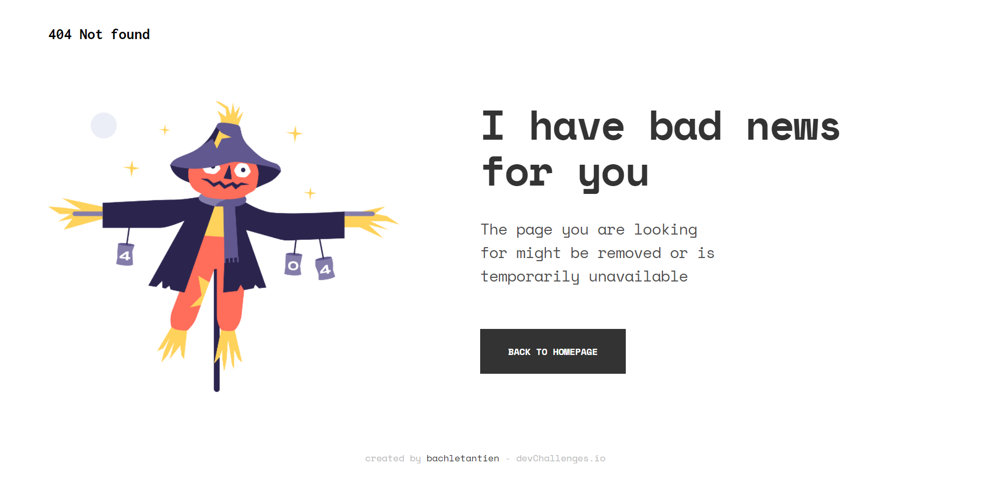

<!-- Please update value in the {}  -->

<h1 align="center">404 NOT FOUND</h1>

   Solution for a challenge from  <a href="http://devchallenges.io" target="_blank">Devchallenges.io</a>.

  <h3>
    <a href="https://404-bachletantien.surge.sh/">
      Demo
    </a>
     | 
    <a href="https://devchallenges.io/solutions/A6z0mt7K7rtsC7isifGA">
      Solution
    </a>
     | 
    <a href="https://devchallenges.io/challenges/wBunSb7FPrIepJZAg0sY">
      Challenge
    </a>
  </h3>

<!-- TABLE OF CONTENTS -->

## Table of Contents

- [Overview](#overview)
  - [Built With](#built-with)
- [Features](#features)
- [Contact](#contact)
- [Acknowledgements](#acknowledgements)

<!-- OVERVIEW -->

## Overview

### Built With

- [HTML](https://developer.mozilla.org/en-US/docs/Web/HTML)
- [SASS](https://sass-lang.com/)

## Features

This application/site was created as a submission to a [DevChallenges](https://devchallenges.io/challenges) challenge. The [challenge](https://devchallenges.io/challenges/wBunSb7FPrIepJZAg0sY) was to build an application to complete the given user stories.

- [x] I can see a page following the given design

## Contact

- GitHub [@bachletantien](https://github.com/bachletantien)
